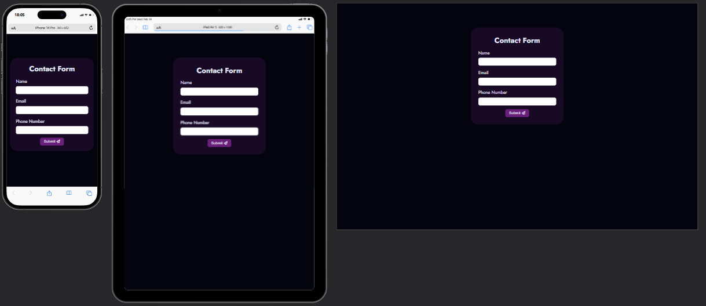
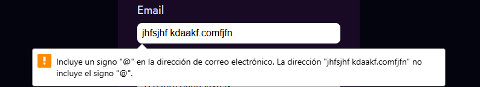
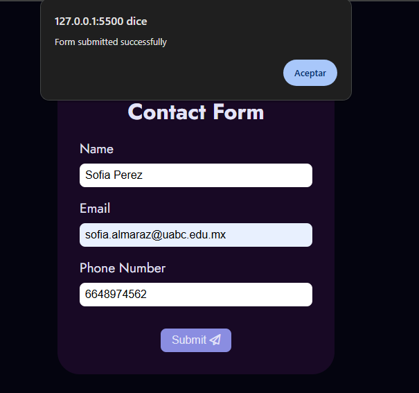
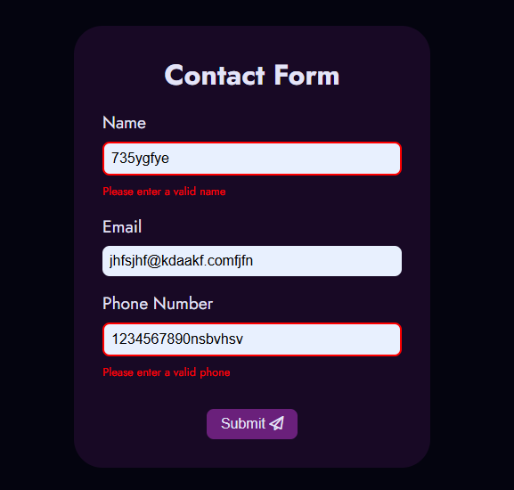

# WD-PRAC-4
Contact form with interactive validations using JavaScript.

## Description
This practice is a simple and responsive contact form page designed to collect info from the user, such as name, email and phone number. 
## Features
- The webpage is responsive.
- If the user enters invalid data, an error (highlighted in red) is displayed below the corresponding input field.
- It uses regular expressions to validate the name, email and phone number fields.
- It prevents submissions from any field with invalid data. 
## Scripts 
**Key components of the validations:**

**DOMContentLoaded:** It waits until the webpage has fully loaded before running the code.
```js
document.addEventListener('DOMContentLoaded', function() {
});
```
___

It's selecting the form and its input fields (name, email, and phone) using their id attributes. It stores them in variables so it can easily access them later.
```js
const inputs = {
    name: document.getElementById('name'),
    email: document.getElementById('email'),
    phone: document.getElementById('phone')
};
```
___
**This part sets up two things:** 
```js
const error = {
    name: document.getElementById('nameError'),
    email: document.getElementById('emailError'),
    phone: document.getElementById('phoneError')
};

```
These are HTML elements where it'll display error messages if something goes wrong.

```js
const errorMessages = {
    name: 'Please enter a valid name',
    email: 'Please enter a valid email address',
    phone: 'Please enter a valid phone'
};
```
These are the actual messages it'll show if the user enters invalid data.
___
**These two functions handle displaying and hiding errors:**
```js
function showError(field) {
    inputs[field].classList.add('error');
    error[field].style.display = 'block';
    error[field].textContent = errorMessages[field];
}
```
Adds a CSS class (error) to the input field to highlight it, displays the error message, and sets the text.
```js
function hideError(field) {
    inputs[field].classList.remove('error');
    error[field].style.display = 'none';
    error[field].textContent = '';
}
```
Removes the error class, hides the error message, and clears the text.
___

**These are regular expressions (regex) that define what valid input looks like for each field:**
- Name: Only letters, spaces, and certain punctuation.
- Email: Must have an @ symbol and a domain (e.g., example.com).
- Phone: Must be 10–15 digits, with optional spaces, dashes, or parentheses.
```js
const patterns = {
    name: /^[a-z ,.'-]+$/i,
    email: /^[^\s@]+@[^\s@]+\.[^\s@]+$/,
    phone: /^[\d\s\-+()]{10,15}$/
};
```
___
**This function checks if a field's input is valid:**

- It trims any extra spaces from the input.
- It tests the input against the corresponding regex pattern.
- If the input is invalid, it shows the error and returns false.
- If the input is valid, it hides the error and returns true.

```js
function validateField(field) {
    const value = inputs[field].value.trim();
    const isValid = patterns[field].test(value);

    if (!isValid) {
        showError(field);
        return false;
    } else {
        hideError(field);
        return true;
    }
}
```
___
**This part listens for when the user tries to submit the form:**

- e.preventDefault(): Stops the form from submitting immediately (so we can validate first).
- It loops through all the input fields and checks if they're valid using validateField().
- If any field is invalid, it sets isValid to false.
- If all fields are valid, it shows a success message and submits the form.

```js
form.addEventListener('submit', function(e){
    e.preventDefault();
    let isValid = true;
    Object.keys(inputs).forEach(field => {
        if (!validateField(field)) {
            isValid = false;
        }
    });
    if (isValid) {
        alert('Form submitted successfully');
        form.submit();
    }
});
```


## Images
- Full page on different devices:


- Email validation:


- When it's valid:


- Other validations:


## Link to GitHub
[GitHub Repository](https://github.com/faiyamm/WD-PRAC-4)